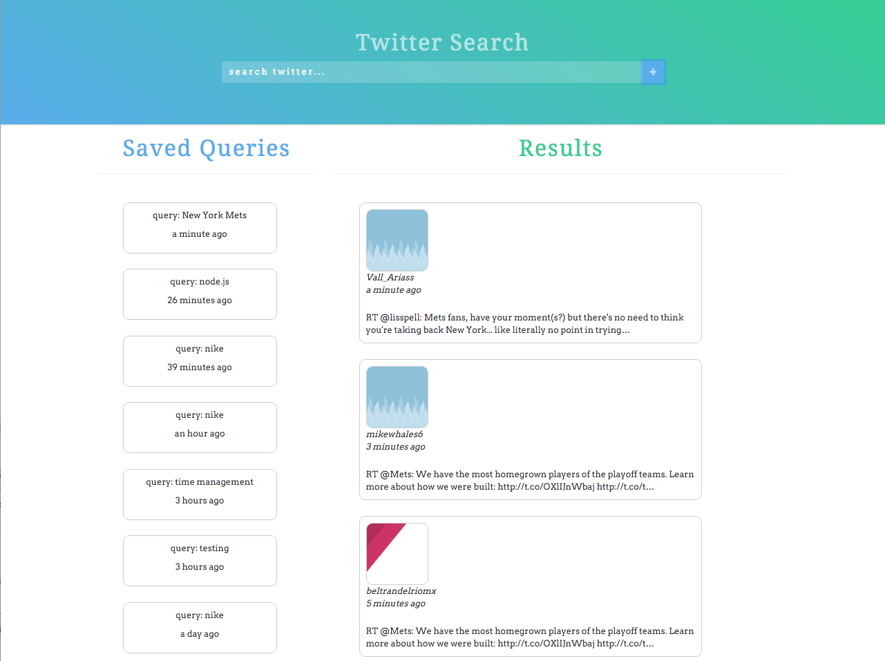

#Tweet Search
---

Tweet search is a small mean stack app that searches Twitter by the user provided query terms. The hosted app is [here!](https://tweet-search-app.herokuapp.com/)


##Installation
1. Setup environment variables with the following:
  * Consumer Key
  * Consumer Secret
  * Token Key
  * Token Secret
2. Run ```npm install``` to setup node dependencies
3. Run ```bower install``` to setup angular dependencies
4. Run ```sudo mongod --dbpath=/data --port 27017``` to turn on mongodb
5. Run ```node server.js``` to start node server
6. Visit http://localhost:8080 on your browser to see the app
